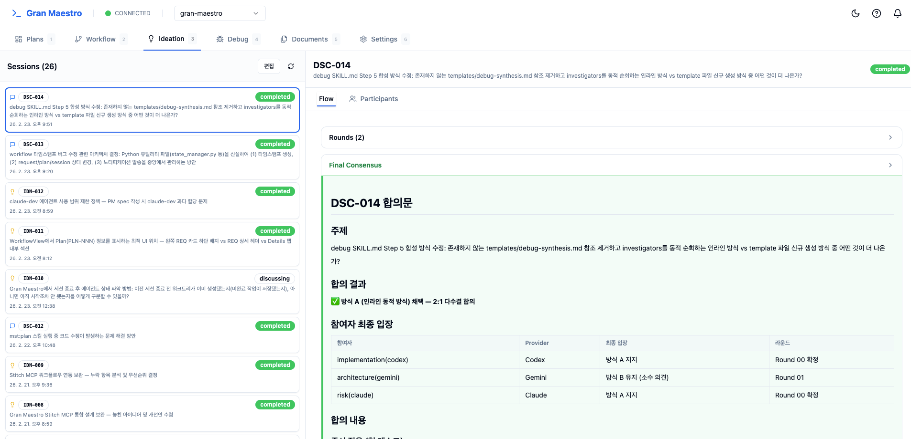

# Gran Maestro

[한국어](README.md) | [English](README.en.md)

> **"I am the Maestro — I conduct, I don't code."**

Vague requests to AI produce wrong results fast.
What you need is a planning step before code — one where AI thinks with you.
Gran Maestro turns that planning step into an AI partnership and automatically carries validated plans through to implementation — a **plan-centric end-to-end AI orchestration platform**.

```bash
/plugin marketplace add myrtlepn/gran-maestro
```



[Q&A Planning](#feature-summary) | [Multi-angle Brainstorming](#feature-summary) | [Team Discussion](#feature-summary) | [UI Visualization](#feature-summary) | [Code Exploration](docs/skills-reference.en.md)

---

The most important thing is the plan. Conventional spec documents and PRDs create a gap between writing and execution. When context is lost before implementation begins, time, focus, and trust erode together. Gran Maestro connects the entire process — **plan, spec, implement, verify, merge** — into a single continuous flow.

`/mst:plan` asks the right questions instead of writing code. Each answer sharpens the next question, turning a vague request into an actionable plan. When you hit a wall, the AI team collects perspectives from multiple angles (ideation) and debates until consensus is reached (discussion).

```
> /mst:plan "Improve the login screen"

[PM] Two decisions are needed:
  1. Add social login, or improve the existing form?
  2. Switch session management to JWT?

> If you're stuck, use ideation to gather opinions from the AI team.
```

Text-only agreement leaves gaps unchecked — screens are visualized instantly with Stitch, and completed plans are reviewed by multiple AIs in dedicated roles (Plan Review). Validated plans become implementation specs via `/mst:request` and are handed off to the Codex and Gemini engineering team for automatic implementation via `/mst:approve`. Once implementation is done, `/mst:review` verifies against acceptance criteria, and `/mst:accept` completes the merge. The dashboard lets you track progress and rationale in real time. Get started with the Quick Start below.

## Quick Start

**Prerequisites**: Claude Code (v1.0.33 or later), [Codex CLI](https://github.com/openai/codex), [Gemini CLI](https://github.com/google-gemini/gemini-cli) — used for multi-agent implementation.

```bash
/plugin marketplace add myrtlepn/gran-maestro
/plugin install mst@gran-maestro
```

```
# 1. Expand multiple requests as plans
/mst:plan Improve login screen
/mst:plan Add API endpoint
/mst:plan Fix dashboard error

# 2. Review specs and start execution in batch
/mst:list
/mst:approve PLN-001 PLN-002 PLN-003
```

Single-request mode is also available: `/mst:request`

Detailed installation guide: [docs/quick-start.en.md](docs/quick-start.en.md)

## What's New

**0.54.x** highlights:

- **Intent System**: Store and track feature intents (JTBD) to ensure intent consistency from plan through implementation and verification (`/mst:intent`)
- **Browser UI Testing**: Automatically link browser tests from plan/request/review on UI changes, with screenshot capture and verification
- **Q&A Context Capture**: Auto-learn user question/answer patterns to accumulate preferences and reduce repetitive questions
- **Gardening**: Automatically detect stale plans, requests, and intents and generate reports (`/mst:gardening`)
- **Chrome Extension picks**: Capture UI elements directly in the browser, select them with `/mst:picks`, and convert to plans

## Feature Summary

Over 35 skills available.

**Core Execution Chain**

| Feature | Command | Purpose |
|---------|---------|---------|
| Q&A Planning | `/mst:plan` | Refine requirements through questions, produce validated plans |
| Implementation Spec | `/mst:request` | Convert plans into implementable specs (spec.md) |
| Approve & Execute | `/mst:approve` | Verify specs, auto-dispatch to Codex/Gemini team |
| AC Verification Review | `/mst:review` | Multiple AIs verify against acceptance criteria in parallel |
| Merge & Cleanup | `/mst:accept` | Worktree merge + cleanup |

**Collaboration & Analysis**

| Feature | Command | Purpose |
|---------|---------|---------|
| Multi-angle Brainstorming | `/mst:ideation` | AI team collects opinions in parallel, PM synthesizes |
| Team Discussion | `/mst:discussion` | Iterative discussion until consensus is reached |
| Bug Investigation | `/mst:debug` | 3 AIs investigate bugs in parallel, consolidated report |
| Intent Management | `/mst:intent` | Store, track, and verify intents based on JTBD |

**Tools & Utilities**

| Feature | Command | Purpose |
|---------|---------|---------|
| UI Visualization | `/mst:stitch` | Generate UI mockups instantly with Stitch |
| Code Exploration | `/mst:explore` | Autonomous codebase exploration, evidence for specs |
| Capture Management | `/mst:picks` | Select Chrome Extension captures, convert to plans |
| Dashboard | `/mst:dashboard` | Start/manage the dashboard server |
| Cleanup Report | `/mst:gardening` | Auto-detect stale plans/requests/intents |

Full skill list: [docs/skills-reference.en.md](docs/skills-reference.en.md)

## Documentation

**Getting Started**
- [Quick Start](docs/quick-start.en.md) — prerequisites, installation, Stitch MCP setup, authentication
- [Configuration](docs/configuration.en.md) — complete config.json option reference
- [Chrome Extension Setup](docs/extension-setup.md) — browser capture extension installation guide
- [Agent Assignments](docs/config-agent-assignments.md) — domain-to-agent mapping guide

**In Depth**
- [Skills Reference](docs/skills-reference.en.md) — detailed usage of 35 skills
- [Dashboard](docs/dashboard.en.md) — hub architecture, views, API endpoints
- [Best Practices](docs/best-practices.en.md) — efficient workflow patterns
- [OMX Guide](docs/omx-guide.en.md) — oh-my-codex install, AGENTS.md customization, trigger reference
- [Hook Setup](docs/HOOK-SETUP.md) — Git Hook setup guide

**Reference**
- [Glossary](docs/glossary.en.md) — official terms and ID system
- [Changelog](CHANGELOG.md) — version history

## License

MIT License — see [LICENSE](LICENSE) for details.
